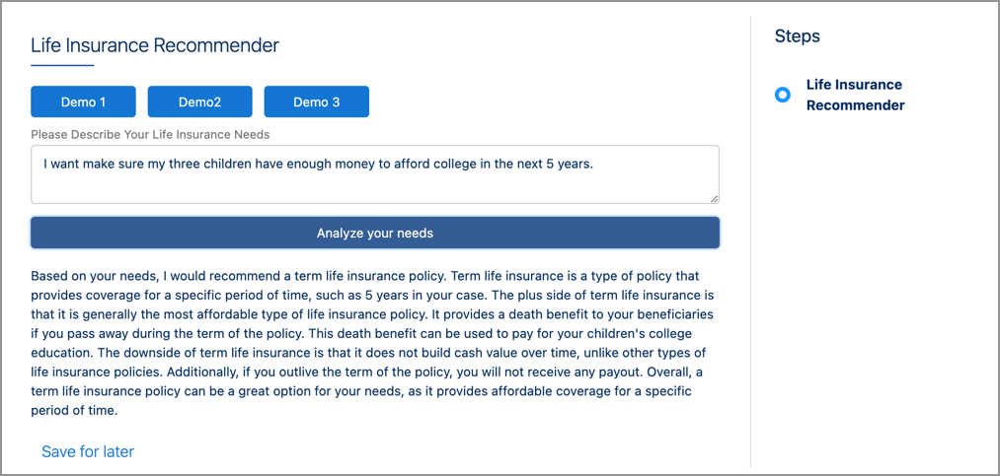

# LifeInsRecommender
A Life Insurance Policy Type Recommender built with Salesforce and OpenAI's GPT.  This is not meant to be a complete solution, but rather a demonstration of how to tie all the components together to produce a solution.  The basic idea is that the user describes, in english, what their insurance needs are.  ChatGPT then either recommends a policy type or asks for more information.

This is discussed in my substack, [McGuinness on AI](https://mcguinnessai.substack.com/about).

This project requires the use of OmniStudio in Salesforce as well as your own API key to work.  

## Installation

To install this, go into the list of OmnScripts in Salesforce, and import the file *Life Ins Recommender.json*.  Do not activate either the OmniScript nor the Integration Procedure.

Edit the Integration Procedure *OpenAI_callGPTSystemUser*; the step callGPT has a REST Header for Authorization that needs to be updated with your OpenAI Key.  Once that's done, activate the Integration Procedure.

## Usage

The demo is very simple.  In the OmniScript, the Set Values statement at the beginning prepares the prompt to generate the output we want.  The three Demo buttons allow you to save on some typing, although you are allowed to enter your own text, of course.  Pressing the Analyze button sends the data to the Integration Procedure and retrieves the response.

## Further Information

For more information on this repository and related topics, please subscribe to my [substack newsletter](https://mcguinnessai.substack.com/about).
